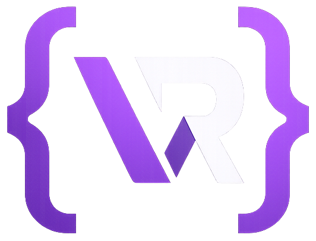
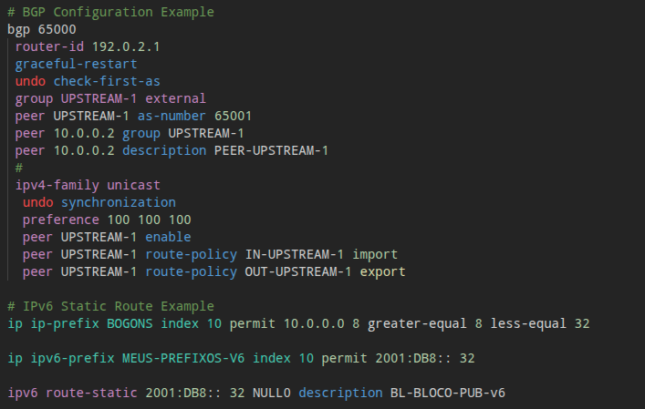

<div align="center">
  

  # FL Solutions — Huawei VRP
  
  **Chega de errar sintaxe de madrugada! Syntax highlighting e snippets de respeito para Huawei VRP no VS Code.**

  [](#)
  [](#)
  [](#)
</div>

---

## 📖 O que tem aqui?

- [Qual é a pegada?](#-qual-é-a-pegada)
- [✨ O que salva a vida?](#-o-que-salva-a-vida)
- [🚀 Como instalar](#-como-instalar)
- [💻 Como fica a tela?](#-como-fica-a-tela)

---

## 🧐 Qual é a pegada?

Essa extensão nasceu na **FL Solutions** da nossa própria necessidade operacional. Quem opera rede sabe como é: você vai fechar aquele BGP ou subir um BNG no **Huawei NetEngine (NE8000, etc)**, o bloco de config é gigante, e qualquer letrinha esquecida te dá uma baita dor de cabeça (e as vezes um rollback na manutenção).

O objetivo aqui é simples: **ajudar a bater o olho e achar o erro rápido**, além de **ganhar tempo na digitação** com snippets que já entregam a configuração mastigada pro roteador.

---

## ✨ O que salva a vida?

### Cores que fazem sentido (Syntax Highlighting)

O VS Code vai colorir os comandos de VRP pra você não se perder. Destaque pra quem precisa:

| O que a gente pinta | Como fica |
| :--- | :--- |
| **BGP** | `bgp 65000`, `group`, `peer`, `ipv4-family unicast` |
| **OSPF / OSPFv3** | `ospf 1 router-id`, `ospfv3 1`, `area`, `network` |
| **Route-Policy** | `route-policy`, `if-match`, `apply local-preference` |
| **Interfaces** | `interface Eth-Trunk10`, `vlan-type dot1q` |
| **BNG / BRAS** | `ip-pool bas`, `radius-server`, `pppoe-server` |
| **IPs (v4 e v6)** | Highlight automático pra você não errar o bloco visualmente |
| **Ações Padrão** | <span style="color:green">`permit`</span> e <span style="color:green">`import`</span> (Verdes), `export` (Colorido), <span style="color:red">`deny`</span> (Vermelho) |
| **Perigo! ⚠️** | Comandos como <span style="color:red">**`reboot`**, **`reset`**, **`shutdown`**</span> gritam na tela em vermelho |

---

### Snippets (É só dar Tab!)

Chega de copiar e colar do bloco de notas ou ficar caçando template antigo. Digita o atalho, aperta `Tab` e a config cai pronta:

#### 🌐 Roteamento
- `bgp-peer-group-v4` ou `v6` — Monta o BGP completo com peer group.
- `ospf-full` / `ospfv3-full` — OSPF base redondinho.

#### 🛡️ Filtros e Políticas
- `rp-inbound` / `rp-outbound-v4` — Route-policies prontas de IN e OUT.
- `ip-prefix-bogons` — Prefix-list de Bogons RFC (pra não ter que lembrar os blocos de cabeça).

#### 🛜 BNG / BRAS
- `bng-domain`, `bng-ip-pool`, `bng-virtual-template` — Padrão pra subir um PPPoE Server rapidão.

#### 🔧 Geral
- `iface-sub-dot1q` — Cria subinterface com VLAN.
- `ssh-harden` / `snmp-v3` — Segurança já nos padrões fortes atuais.

*(Dá um `Ctrl+Space` no arquivo `.vrp` pra ver a lista toda!)*

---

## 🚀 Como instalar

Como isso é um projeto nosso, a instalação é manual, mas é jogo rápido:

1. **Baixa o repositório pra sua máquina**:
   ```bash
   git clone https://github.com/flicl/vscode-vrp.git flsolutions.vrp-0.1.0
   ```

2. **Joga a pasta lá nos plugins do seu VS Code**:
   - **Windows:** Aperta `Win + R`, joga `%USERPROFILE%\.vscode\extensions` e dá Enter. Arrasta a pasta `flsolutions.vrp-0.1.0` pra lá.
   - **Linux / Mac:** Move pro diretório oculto `~/.vscode/extensions/`.
     ```bash
     mv flsolutions.vrp-0.1.0 ~/.vscode/extensions/
     ```

3. **Reinicia o VS Code** (ou aperta `F1` e digita `Reload Window`).

4. Já era! Abriu arquivo `.vrp` ou `.cfg`, as cores já entram em ação.

---

## 💻 Como fica a tela?

Dá uma olhada no visual:

<div align="center">
  
</div>

> *(Lembrando que as cores exatas mudam de acordo com o tema que você usa no seu VS Code, mas a lógica de destacar o que importa é a mesma!)*

---

## 📄 Licença

Tá liberado na licença **MIT** - o arquivo [LICENSE.txt](LICENSE.txt) tá aí pra quem quiser ler o juridiquês.

<div align="center">
  <sub>Criado a base de muito café pela equipe <b>FL Solutions</b> (2026).</sub>
</div>
